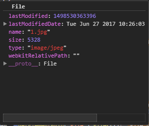

<Excerpt in index | 首页摘要> 
zTree记录
<!-- more -->
<The rest of contents | 余下全文>

-----
### 1.资料

[HTML5 File API]:https://developer.mozilla.org/en-US/docs/Using_files_from_web_applications
[File]:https://developer.mozilla.org/zh-CN/docs/Web/API/File
[FileList]:https://developer.mozilla.org/zh-CN/docs/Web/API/FileList
[DataTransfer]:https://developer.mozilla.org/zh-CN/docs/Web/API/DataTransfer
[HTML 拖放 API]:https://developer.mozilla.org/zh-CN/docs/Web/API/HTML_Drag_and_Drop_API
[W3C FileAPI]:https://www.w3.org/TR/FileAPI/
[FileReader]:https://developer.mozilla.org/zh-CN/docs/Web/API/FileReader

- HTML5 File API
	- [HTML5 File API][]
	- [File][]
	- [FileList][]
	- [DataTransfer][]
	- [HTML 拖放 API][]
	- [W3C FileAPI][]
	- [FileReader][]

### 2.HTML5 File API
新增的HTML5 DOM的File API可以让我们在前端这边就可以处理文件上传。文件上传可以使用input标签，也可以使用拖拽（drag and drop）方式来完成

#### 2.1使用HTML获取本地上传文件
html
```html
<input type="file" id="input">
```
如果要上传多个文件，需要给input加上`multiple="multiple"`
```html
<input type="file" id="input" multiple="multiple">
```
**上传单个文件：**
使用DOM获取上传文件
```javascript
var selectedFile = document.getElementById('input').files[0];
```
使用jQuery获取上传文件
```javascript
var selectedFile = $('#input').get(0).files[0];

var selectedFile = $('#input')[0].files[0];
```
**上传多个文件：** 
循环遍历
```javascript
for (var i = 0; i < len; i++) {
    file = document.getElementById('file').files[i];
    alert(file.name);
};
```
**使用change事件来获取上传文件的详细信息**
```
<input type="file" id="input" onchange="handleFiles(this.files)">
```
**使用addEventListener监听事件**
```javascript
var inputElement = document.getElementById("inputField");
inputElement.addEventListener("change", handleFiles, false);

function handleFiles() {
  var fileList = this.files;

  /* now you can work with the file list */
}
```
**美化input文件上传**
自行修改
```html
<!DOCTYPE html>
<html lang="en">

<head>
    <meta charset="UTF-8">
    <meta name="viewport" content="width=device-width, initial-scale=1.0">
    <meta http-equiv="X-UA-Compatible" content="ie=edge">
    <title>Document</title>
</head>

<body>
    <input type="file" id="fileElem" multiple="true" accept="image/*" style="display:none" onchange="handleFiles(this.files)">
    <a href="#" id="fileSelect">Select some files</a>
</body>
<script>
    var fileSelect = document.getElementById("fileSelect"),
        fileElem = document.getElementById("fileElem");

    fileSelect.addEventListener("click", function (e) {
        if (fileElem) {
            fileElem.click();
        }
        e.preventDefault(); // prevent navigation to "#"
    }, false);

</script>

</html>
```
File API 可以在 [File][] 文件中得到 [FileList][] ，[FileList][] 内包含上传文件的所有信息。

**File 接口**

 文件[File][] 接口提供有关文件的信息，并允许网页中的 JavaScript 访问其内容。如下图：



通常情况下， [File][] 对象是来自用户在一个   <input> 元素上选择文件后返回的 [FileList][] 对象,也可以是来自由拖放操作生成的 DataTransfer[文件拖拽][] 对象，或者来自 HTMLCanvasElement 上的 mozGetAsFile() API。

##### 构造函数
File():返回一个新构建的文件对象（File）。

##### 属性
File.lastModified:返回当前 File 对象所引用文件最后修改时间， 自 1970年1月1日0:00 以来的毫秒数。

File.lastModifiedDate:返回当前 File 对象所引用文件最后修改时间的 Date 对象。

File.name :返回当前 File 对象所引用文件的名字。

File.size :返回文件的大小,单位byte。

File.webkitRelativePath :返回 File 相关的 path 或 URL。

File.type :返回文件的 [多用途互联网邮件扩展类型](https://developer.mozilla.org/zh-CN/docs/Web/HTTP/Basics_of_HTTP/MIME_types)

**一个完整的示例：**
```html
<!DOCTYPE html>
<html lang="en">

<head>
    <meta charset='UTF-8' />
    <title>FileList and File </title>
    <script type="text/javascript" language="JavaScript">
        window.onload = function () {
            var bt1 = document.getElementById("bt1");
            bt1.onclick = function () {
                showFiles();
            };
            function showFiles() {
                var file,
                    lastModified,
                    lastModifiedDate,
                    fileName,
                    fileSize,
                    fileUrl,
                    filetType,
                    fileDetail,
                    fileDetail="",//一定要初始化否则+=的时候为undefined
                    textContain = document.getElementById("div1"),
                    len = document.getElementById('file').files.length;//返回FileList文件列表对象
                for (var i = 0; i < len; i++) {
                    file = document.getElementById('file').files[i];
                    lastModified = file.lastModified;
                    lastModifiedDate = file.lastModifiedDate;
                    fileName = file.name;
                    fileSize = file.size;
                    fileUrl = file.webkitRelativePath;
                    filetType = file.type;
                    fileDetail +="文件名称:" + fileName + ",文件大小:" + fileSize + ",文件类型:" +
                        filetType + ",最后修改时间:" + lastModified + ",最后修改时间毫秒数:" + lastModifiedDate +
                        ",文件所在路径:" + fileUrl + "\<br><br>";
                };
                textContain.innerHTML = fileDetail;

            }
        }
    </script>
</head>

<body>
    <input type="file" id='file' multiple="multiple" width="80px" />
    <input type="button" id="bt1" value="上传文件详情"  />
    <div>详情：</div><div id="div1"></div></div>
</body>

</html>
```

####  2.2使用拖拽上传文件
注意查看下面几个API
[HTML 拖放 API][]
[DataTransfer][]
[FileReader][]
**使用拖拽**
首先需要设置我们的拖拽的区域，然后监听 dragenter 、dragover 和 drop事件
```javascript
var dropbox;

dropbox = document.getElementById("dropbox");拖拽的容器
dropbox.addEventListener("dragenter", dragenter, false);
dropbox.addEventListener("dragover", dragover, false);
dropbox.addEventListener("drop", drop, false);
```
我们甚至不需要处理 dragenter 和 dragover事件,阻止事件的传播和预设事件的发生
```javascript
function dragenter(e) {
  e.stopPropagation();
  e.preventDefault();
}

function dragover(e) {
  e.stopPropagation();
  e.preventDefault();
}
```
drop() 函数
```javascript
function drop(e) {
  e.stopPropagation();
  e.preventDefault();

  var dt = e.dataTransfer;
  var files = dt.files;

  handleFiles(files);
}
```
我们使用dataTransfer 来捕获上传的文件并传递给handleFiles()函数。我们发现不论使用拖拽还是其他文件上传形式，他们的根本都是相同的、

#### 图片上传预览
```html
<!DOCTYPE html>
<html lang="en">

<head>
    <meta charset='UTF-8' />
    <style>
        #div1{
            border:3px dashed #d6d6d6;
            width:500px;
            height: 400px;
            margin:100px auto;
        }
    </style>
    <title>拖拽实例</title>
</head>

<body>
    <div id="div1">

    </div>
</body>
<script>
    window.onload = function () {
        var dropbox;

        dropbox = document.getElementById("div1");
        //拖拽进入
        dropbox.addEventListener("dragenter", dragenter, false);
        //拖住滑过
        dropbox.addEventListener("dragover", dragover, false);
        //拖拽
        dropbox.addEventListener("drop", drop, false);

        function dragenter(e) {
            //阻止浏览器的默认事件，如果不加dragenter和dragover的话，浏览器默认打开一个新的tab去预览图片
            e.stopPropagation();
            e.preventDefault();
        }

        function dragover(e) {
            e.stopPropagation();
            e.preventDefault();
        }

        function drop(e) {
            e.stopPropagation();
            e.preventDefault();

            //去看一下DataTransfer的API
            // 在进行拖放操作时，DataTransfer 对象用来保存被拖动的数据。它可以保存一项或多项数据、一种或者多种数据类型
            var dt = e.dataTransfer;
            //再来读取拖拽文件的files信息！files就是个对象，里面放着上传的所有文件
            var files = dt.files;
            //拿到信息以后，我们在调用函数去处理
            handleFiles(files);
        }

        function handleFiles(files) {
            //files.length是上传文件的个数
            for (var i = 0; i < files.length; i++) {
                var file = files[i];
                var imageType = /image.*/;

                if (!file.type.match(imageType)) {
                    continue;
                }

                var img = document.createElement("img");
                //返回元素的类名,用add和remove来进行添加类，删除类。这里就是给img添加了一个obj类
                img.classList.add("obj");
                img.file = file;
                div1.appendChild(img);

                //FileReader 对象允许Web应用程序异步读取存储在用户计算机上的文件
                var reader = new FileReader();
                //当读取操作成功完成时调用
                reader.onload = (function (aImg) { return function (e) { aImg.src = e.target.result; }; })(img);
                //开始读取指定的Blob对象或File对象中的内容. 
                reader.readAsDataURL(file);
            }
        }
    }

</script>
</html>
```