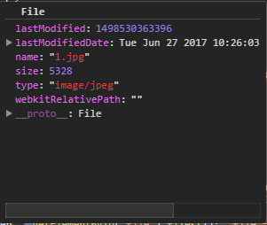

<Excerpt in index | 首页摘要> 
zTree记录
<!-- more -->
<The rest of contents | 余下全文>

-----
### 1.资料

[HTML5 File API]:https://developer.mozilla.org/en-US/docs/Using_files_from_web_applications
[File]:https://developer.mozilla.org/zh-CN/docs/Web/API/File
[FileList]:https://developer.mozilla.org/zh-CN/docs/Web/API/FileList
[文件拖拽]:https://developer.mozilla.org/zh-CN/docs/Web/API/FileList
[W3C FileAPI]:https://www.w3.org/TR/FileAPI/
[FileReader]:https://developer.mozilla.org/zh-CN/docs/Web/API/FileReader

- HTML5 File API
	- [HTML5 File API][]
	- [File][]
	- [FileList][]
	- [文件拖拽][]
	- [W3C FileAPI][]
	- [FileReader][]

### 2.HTML5 File API
新增的HTML5 DOM的File API可以让我们在前端这边就可以处理文件上传。文件上传可以使用input标签，也可以使用拖拽（drag and drop）方式来完成

#### 2.1使用HTML获取本地上传文件
html
```html
<input type="file" id="input">
```
如果要上传多个文件，需要给input加上`multiple="multiple"`
```html
<input type="file" id="input" multiple="multiple">
```
**上传单个文件：**
使用DOM获取上传文件
```javascript
var selectedFile = document.getElementById('input').files[0];
```
使用jQuery获取上传文件
```javascript
var selectedFile = $('#input').get(0).files[0];

var selectedFile = $('#input')[0].files[0];
```
**上传多个文件：** 
循环遍历
```javascript
for (var i = 0; i < len; i++) {
    file = document.getElementById('file').files[i];
    alert(file.name);
};
```
File API 可以在 [File][] 文件中得到 [FileList][] ，[FileList][] 内包含上传文件的所有信息。

**File 接口**

 文件[File][] 接口提供有关文件的信息，并允许网页中的 JavaScript 访问其内容。如下图：



通常情况下， [File][] 对象是来自用户在一个   <input> 元素上选择文件后返回的 [FileList][] 对象,也可以是来自由拖放操作生成的 DataTransfer[文件拖拽][] 对象，或者来自 HTMLCanvasElement 上的 mozGetAsFile() API。

##### 构造函数
File():返回一个新构建的文件对象（File）。

##### 属性
File.lastModified:返回当前 File 对象所引用文件最后修改时间， 自 1970年1月1日0:00 以来的毫秒数。

File.lastModifiedDate:返回当前 File 对象所引用文件最后修改时间的 Date 对象。

File.name :返回当前 File 对象所引用文件的名字。

File.size :返回文件的大小,单位byte。

File.webkitRelativePath :返回 File 相关的 path 或 URL。

File.type :返回文件的 [多用途互联网邮件扩展类型](https://developer.mozilla.org/zh-CN/docs/Web/HTTP/Basics_of_HTTP/MIME_types)

**一个完整的示例：**
```html
<!DOCTYPE html>
<html lang="en">

<head>
    <meta charset='UTF-8' />
    <title>FileList and File </title>
    <script type="text/javascript" language="JavaScript">
        window.onload = function () {
            var bt1 = document.getElementById("bt1");
            bt1.onclick = function () {
                showFiles();
            };
            function showFiles() {
                var file,
                    lastModified,
                    lastModifiedDate,
                    fileName,
                    fileSize,
                    fileUrl,
                    filetType,
                    fileDetail,
                    fileDetail="",//一定要初始化否则+=的时候为undefined
                    textContain = document.getElementById("div1"),
                    len = document.getElementById('file').files.length;//返回FileList文件列表对象
                for (var i = 0; i < len; i++) {
                    file = document.getElementById('file').files[i];
                    lastModified = file.lastModified;
                    lastModifiedDate = file.lastModifiedDate;
                    fileName = file.name;
                    fileSize = file.size;
                    fileUrl = file.webkitRelativePath;
                    filetType = file.type;
                    fileDetail +="文件名称:" + fileName + ",文件大小:" + fileSize + ",文件类型:" +
                        filetType + ",最后修改时间:" + lastModified + ",最后修改时间毫秒数:" + lastModifiedDate +
                        ",文件所在路径:" + fileUrl + "\<br><br>";
                };
                textContain.innerHTML = fileDetail;

            }
        }
    </script>
</head>

<body>
    <input type="file" id='file' multiple="multiple" width="80px" />
    <input type="button" id="bt1" value="上传文件详情"  />
    <div>详情：</div><div id="div1"></div></div>
</body>

</html>
```

####  2.2使用拖拽上传文件
[文件拖拽][]